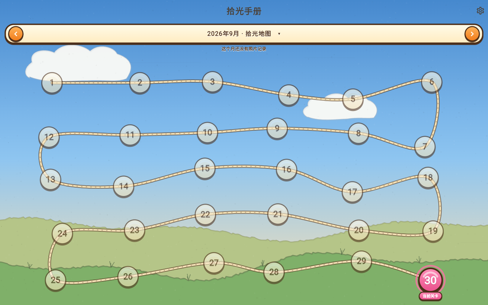

<div align="center">

# 🌾 拾光手册

**把每一天拍成一关闯关地图的 AI 照片日记**


[](https://flutter.dev)
[](#测试)
[](#许可)

**线上体验：** https://qushengxixiaoluo.github.io/lifesnap/

</div>

---

## 这是什么

拾光手册不是又一个相册。它把你的照片按天归档，**每个月铺成一张闯关地图**：

- 节点错落散布，一条小路从 **1 号蜿蜒连接到月末**，像游戏关卡图
- 有照片的日子是亮的糖果扣，没记录的日子矮一截、暗一截，**一眼看出哪些天被好好过过**
- 今天是闪着光的「当前关卡」，未来的日子挂着小锁
- 点开任一节点：**当天的照片 + AI 写的一段中文小总结**

画风有两张皮：**糖果手绘**（吉卜力 × 保卫萝卜——厚描边、果冻按钮、泡泡云）与 **LowPoly 描边**（低多边形平涂色块 + 黑色描边），任一画风都能切换日光 / 黄昏 / 星夜三套天色。



## 功能

### 🗺 闯关地图
- 每月一张地图，节点位置按「种子随机 + 间距松弛」算法生成——**每次打开都一样，但看起来是散落的**
- 五种节点状态：已总结（金星）/ 有照片 / 空白天（缩小减淡）/ 今天（脉冲光环）/ 未来（雾 + 锁）
- 标题栏直显「有照片记录 X 天」；点标题弹**年份 + 月份跳转器**，一步到任意月
- 横滑翻月、路径分状态绘制（实线 / 虚线雾罩）

### 📷 照片管线
- **多来源**：多个本地文件夹（增量扫描，EXIF 拍摄时间优先）+ 手机相册（photo_manager）+ Web 目录选择器（Chromium）
- **缩略图三级缓存**：256 / 512 / 1280 磁盘分桶 + 48MB 内存 LRU
- **全屏查看器**：原图字节流式加载、按屏幕宽降采样解码，双指缩放 8 倍
- 单张照片可**从记录中移除**（绝不碰你系统相册/磁盘里的原文件）

### ✨ AI 每日总结
- **三件套配置**（两种报文格式通用）：`API 地址` / `API Key` / `模型名称`
- 双格式适配器：
  - **Anthropic Messages API**（默认 `claude-opus-5-5`，可换）
  - **OpenAI Chat Completions**（官方或任意兼容中转，自定义 Base URL）
- 点开某天按需生成并缓存；照片增删后**指纹失效**自动提示重新生成
- **生成后可人工编辑**：标题 / 心情 / 正文 / 标签 / 瞬间随手改——AI 打草稿、你来定稿；改文案不触发失效提示，保存失败留在对话框不丢稿
- **补全所有缺失总结**：全库「有照片但没总结」的日子从早到晚排队跑
  - 任务跑在全局服务里——退出界面不中断
  - 队列落盘，**杀掉 App 重开自动续跑**，直到从头到尾补完
- 成本护栏：每日送图上限（默认 12 张）、effort 档位、并发 3

### 🎨 外观
- 三套皮肤：**日光 / 黄昏 / 星夜**，600ms 平滑过渡，重启保持
- 全部手绘感由 CustomPainter 实时绘制（渐变天空、漂移泡泡云、草坡视差、纸纹）

## 快速开始

### 运行（开发）

```bash
flutter pub get
flutter run                    # 选择设备：Chrome / Windows / Android…
```

### 打包

```bash
# 手机 arm64 APK（单架构）
flutter build apk --release --split-per-abi --target-platform android-arm64
# 产物：build/app/outputs/flutter-apk/app-arm64-v8a-release.apk

# Web（部署到 GitHub Pages 用 --base-href）
flutter build web --release --base-href /lifesnap/
```

### 网页版自动部署

推送 `main` 后 GitHub Actions 自动构建并发布到 Pages（见
[.github/workflows/deploy-web.yml](.github/workflows/deploy-web.yml)）。

## AI 配置说明

设置页 → AI 配置：

| 字段 | 说明 |
|---|---|
| 服务商 | `Anthropic`（Messages 报文）或 `OpenAI 兼容`（Chat Completions 报文），只切换**报文格式** |
| API 地址 | Anthropic 留空 = 官方，也可填中转；OpenAI 必填（官方或中转） |
| API Key | 本地加密存储（flutter_secure_storage），保存后可用眼睛开关回显 |
| 模型名称 | 自由填写，如 `claude-opus-5-5`、`claude-sonnet-5-5`、`gpt-4o`、`mimo-v2.6-pro` |

- 点**测试连接**验证三件套是否配通
- 生成按张计费（走你自己的 Key），费用由你的服务商决定

## 平台支持

| 平台 | 状态 | 说明 |
|---|---|---|
| Android | ✅ | 相册扫描 + 文件夹；已验证 arm64 APK |
| Web | ✅ | Chrome/Edge 目录选择器扫描；其他浏览器手动多选降级 |
| Windows | ✅ | 文件夹扫描（需 VS + Windows SDK 构建） |
| Linux / macOS | 🟡 | 代码兼容，未在本机出包验证 |
| iOS | 🟡 | 代码兼容；出包需 macOS + Xcode |

## 项目结构

```
lib/
├── app/            # 主题令牌、路由、全局服务（批量任务、服务注入）
├── core/
│   ├── models/     # 共享数据模型（dayKey、Photo、AiSummary…）
│   ├── storage/    # 存储抽象 + sqflite(移动)/hive(桌面/Web) 条件导入
│   ├── scanning/   # 文件夹/相册/Web 三路扫描 + 增量索引
│   ├── thumbnails/ # 三级缩略图缓存 + 原图加载器
│   └── ai/         # Anthropic/OpenAI 双适配器、宽容 JSON 解析、总结仓库
├── features/
│   ├── calendar_map/  # 闯关地图（种子布局、路径绘制、月份跳转）
│   ├── day_detail/    # 日详情面板 + 全屏查看器
│   └── settings/      # 照片源 / AI 配置 / 批量生成 / 外观
└── widgets/           # 天空背景、手绘卡片、糖果 painter 全家桶
```

## 测试

```bash
flutter test        # 117 个用例：存储契约、扫描增量、布局种子、AI 双格式、批量断点续跑…
flutter analyze     # 0 issue
```

视觉回归：`test/golden_view_test.dart` 用 Skia 软渲染出金样张，
改画风后 `flutter test --update-goldens test/golden_view_test.dart` 一键更新。

## 许可

个人自用项目，未申请开源许可。API Key 请自备，注意不要把 Key 提交进代码或截图。
